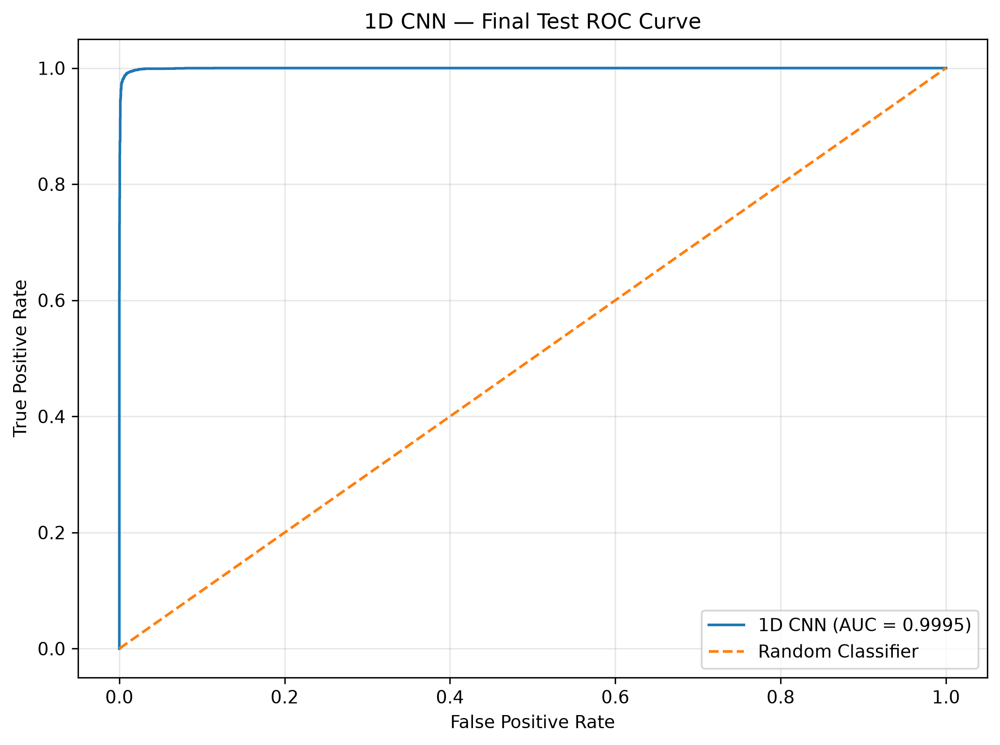
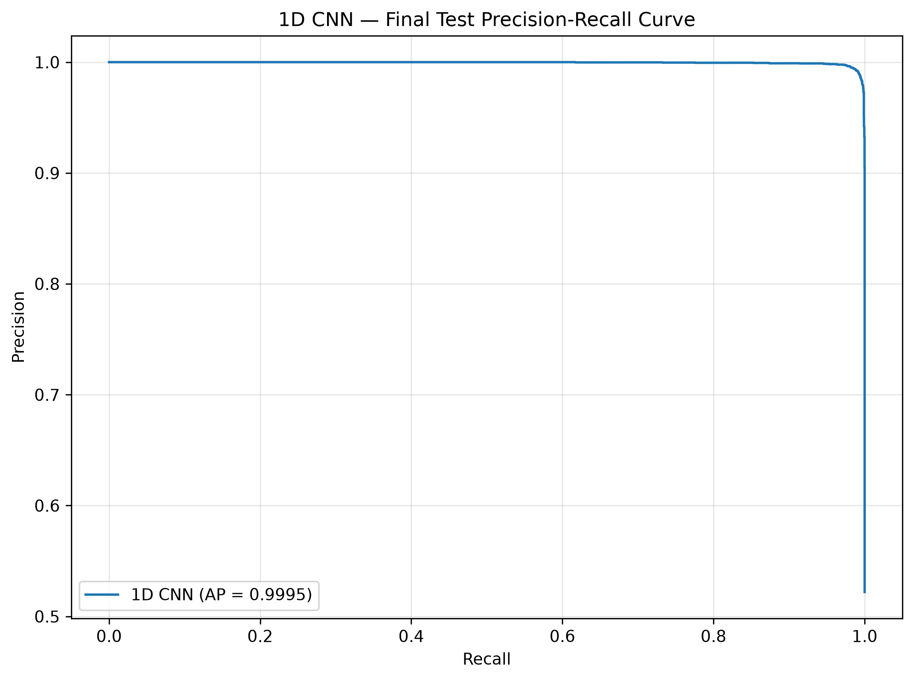
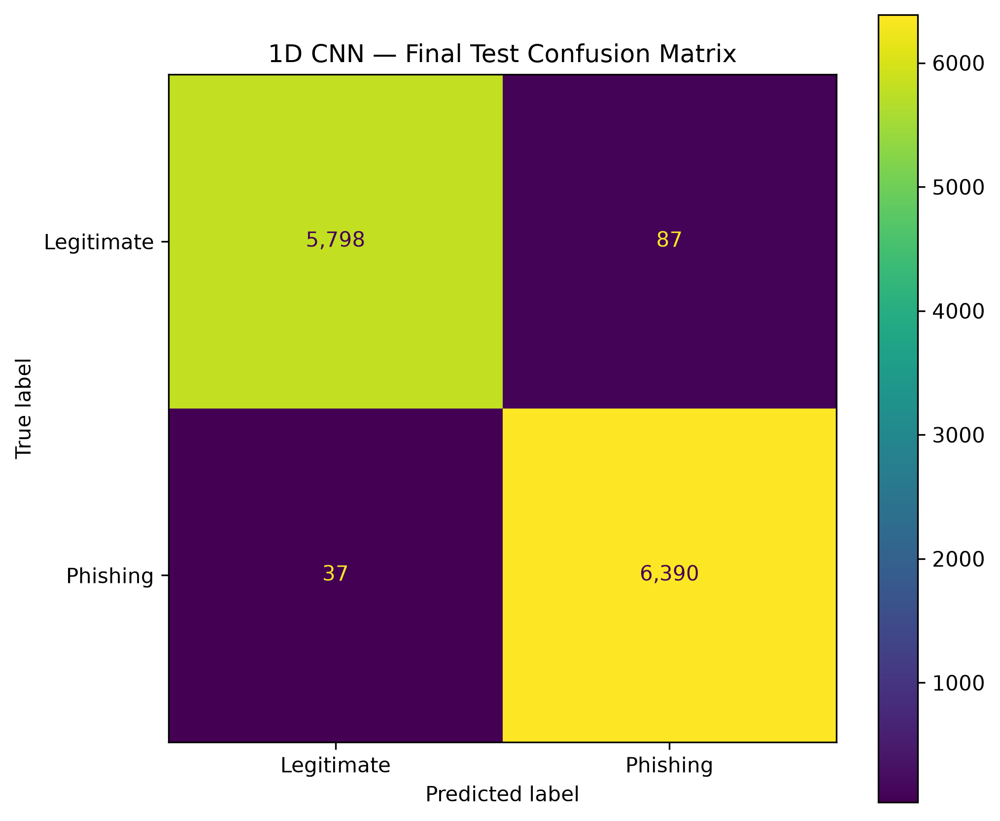
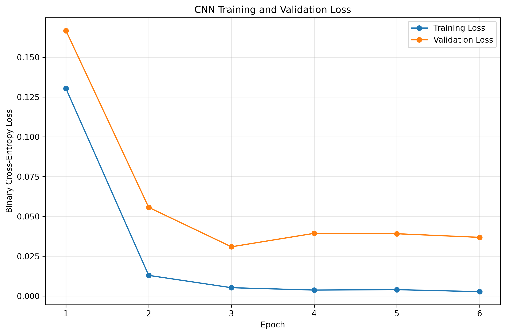
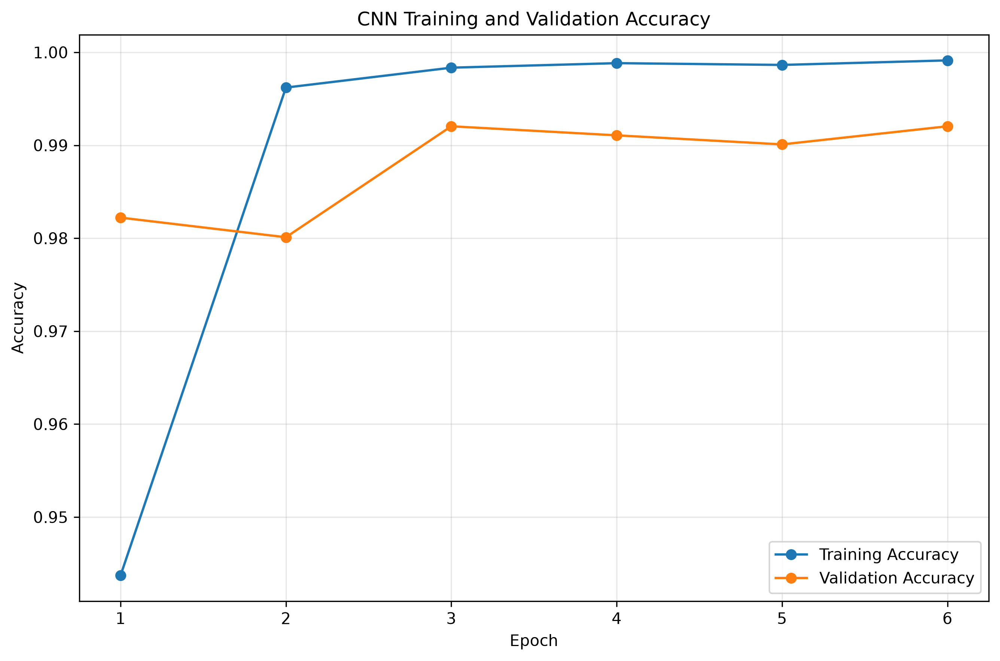
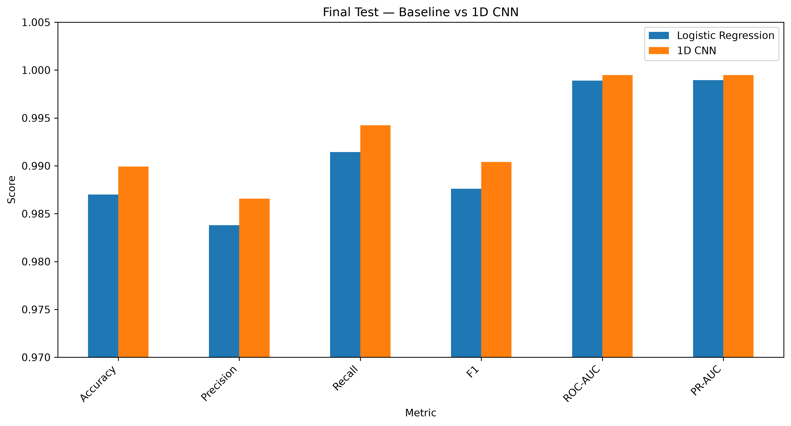
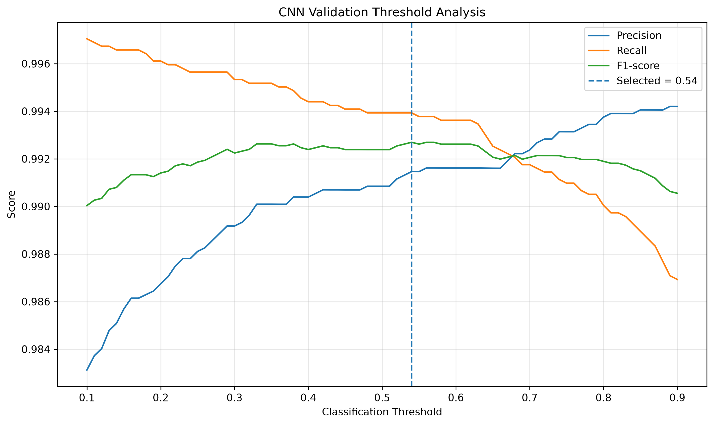
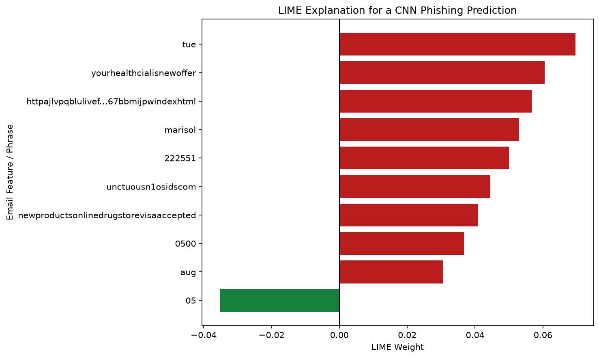

# ITRI625 Machine Learning Project

## AI-Based Phishing Email Detection System

**Project title:** PhishGuard AI

**Module:** ITRI625

**Student name:** Lwazi Nhlapo

**Student number:**

**GitHub Repository:**
https://github.com/Lwazi-Junior/ITRI625-Phishing-Email-Detection

---

## 3.1 Model Scenario

Phishing emails are a significant cybersecurity threat because they attempt to deceive users into revealing sensitive information, opening malicious attachments, transferring money, or visiting fraudulent websites. The scenario addressed in this project is therefore the automatic classification of email messages as either legitimate or phishing using machine learning and deep learning techniques.

The developed system, named PhishGuard AI, accepts the raw textual content of an email and analyses it using a trained one-dimensional Convolutional Neural Network (1D CNN). The model produces a phishing probability and classifies the message as either Legitimate (class 0) or Phishing (class 1). A classification threshold of 0.54, selected using the validation dataset before final testing, is used to convert the model probability into the final class prediction.

The trained model is deployed through a FastAPI REST API and integrated into a Tkinter desktop application. A user can paste an email into the application and receive the predicted class, phishing probability, legitimate probability, confidence level and risk level. The application also includes LIME-based Explainable Artificial Intelligence (XAI), which provides a local explanation showing which words or textual features influenced an individual prediction.

This system is useful in cybersecurity because it demonstrates how artificial intelligence can support the early identification of potentially malicious email messages before users interact with suspicious links, attachments or requests for credentials. It can therefore function as a decision-support mechanism for users or security analysts rather than relying only on manual inspection. The model does not guarantee that an email is safe or malicious, but provides an automated risk assessment that can assist further security investigation.

```text
┌─────────────────────┐
│    Raw Email Text   │
└──────────┬──────────┘
           │
           ▼
┌─────────────────────┐
│      Tkinter GUI    │
└──────────┬──────────┘
           │
           ▼
┌─────────────────────┐
│     FastAPI API     │
└──────────┬──────────┘
           │
           ▼
┌─────────────────────┐
│      1D CNN Model   │
└──────────┬──────────┘
           │
           ▼
┌─────────────────────┐
│ Phishing Probability│
│  Threshold = 0.54   │
└──────────┬──────────┘
           │
           ▼
┌─────────────────────┐
│ Legitimate/Phishing │
│ + Confidence + XAI  │
└─────────────────────┘
```

**Figure 1:** PhishGuard AI phishing-email detection scenario and deployment workflow.

## 3.2 Model Architecture

The primary model developed for PhishGuard AI is a one-dimensional Convolutional Neural Network (1D CNN) designed for binary text classification. The CNN receives the raw textual content of an email and produces a probability indicating whether the message belongs to the phishing class. The model was implemented using TensorFlow/Keras and incorporates text vectorisation, learned word embeddings, convolutional feature extraction, regularisation and fully connected classification layers.

The overall architecture used in the final experiment is:

```text
Raw Email Text
      │
      ▼
TextVectorization
Maximum vocabulary: 30,000 tokens
Sequence length: 300 tokens
      │
      ▼
Embedding
30,000 vocabulary × 64 dimensions
      │
      ▼
SpatialDropout1D (0.20)
      │
      ▼
Conv1D
128 filters
Kernel size = 5
Activation = ReLU
      │
      ▼
GlobalMaxPooling1D
      │
      ▼
Dense (128 neurons)
Activation = ReLU
      │
      ▼
BatchNormalization
      │
      ▼
Dropout (0.30)
      │
      ▼
Dense (64 neurons)
Activation = ReLU
      │
      ▼
Dropout (0.30)
      │
      ▼
Dense (1 neuron)
Activation = Sigmoid
      │
      ▼
Phishing Probability
```

**Figure 2:** Architecture of the PhishGuard AI 1D CNN phishing-email classifier.

| Layer | Configuration | Purpose |
|---|---|---|
| Input | Raw string | Accept raw email text |
| TextVectorization | 30,000 tokens, sequence length 300 | Convert text to integer sequences |
| Embedding | 64 dimensions | Learn token representations |
| SpatialDropout1D | 0.20 | Reduce embedding overfitting |
| Conv1D | 128 filters, kernel 5, ReLU | Detect local textual patterns |
| GlobalMaxPooling1D | Global maximum | Retain strongest detected features |
| Dense | 128, ReLU | Learn higher-level combinations |
| BatchNormalization | — | Stabilise hidden activations |
| Dropout | 0.30 | Regularisation |
| Dense | 64, ReLU | Condense learned features |
| Dropout | 0.30 | Regularisation |
| Output | 1, Sigmoid | Produce phishing probability |

**Table 1:** Layer-by-layer configuration and purpose of the PhishGuard AI 1D CNN.

### Text Vectorisation Layer

The first stage of the network is a TextVectorization layer. This layer converts raw email text into integer token sequences that can be processed by the neural network. A maximum vocabulary size of 30,000 tokens was used, while each email was represented using a fixed sequence length of 300 tokens.

The vectoriser was adapted only on the training dataset. Validation and test emails were not used to learn the vocabulary. This prevents information from the validation or independent test sets from leaking into the training process.

A fixed sequence length is necessary because neural networks process inputs in batches and therefore require consistent input dimensions. Emails longer than the configured sequence length are truncated, while shorter messages are padded.

### Embedding Layer

After vectorisation, the integer token sequences are passed to an Embedding layer with an embedding dimension of 64. Instead of treating words as unrelated integer identifiers, the embedding layer learns dense numerical representations of tokens during model training.

These learned representations allow the network to model relationships between words and textual patterns. This is useful in phishing detection because malicious emails frequently contain combinations of terms relating to account verification, urgency, credentials, payments, suspicious links and other social-engineering behaviour.

Unlike the Logistic Regression baseline, which relies on a fixed TF-IDF representation, the embedding vectors are learned jointly with the CNN during training.

### Spatial Dropout Layer

A SpatialDropout1D layer with a dropout rate of 0.20 is applied after the embedding layer. Spatial dropout removes complete embedding feature channels during training rather than independently dropping individual values.

This acts as a regularisation technique and reduces the likelihood that the model will become overly dependent on a limited number of learned embedding features. Its purpose is therefore to improve generalisation to unseen email messages.

### One-Dimensional Convolutional Layer

The main feature-extraction stage uses a Conv1D layer with 128 filters, a kernel size of 5, and the ReLU activation function.

The convolutional filters move across the token sequence and learn local textual patterns. A kernel size of five allows each filter to examine short neighbouring token sequences rather than analysing every word independently. This is useful for phishing-email detection because suspicious meaning often occurs in combinations or short sequences of words rather than in isolated terms.

Examples of patterns that a convolutional model may learn include language associated with urgent action, account verification, credential requests, financial requests, suspicious links and other phishing-related communication patterns.

The Rectified Linear Unit (ReLU) activation function is used to introduce non-linearity into the network. ReLU returns positive activations while setting negative values to zero, allowing the CNN to learn complex nonlinear relationships within the email text.

### Global Max Pooling Layer

The output of the convolutional layer is passed through GlobalMaxPooling1D. For each convolutional filter, this layer keeps the strongest activation detected anywhere in the email.

This reduces the sequential convolution output to a fixed-size feature vector. In the context of phishing detection, the approach is useful because a strong phishing-related pattern may be important regardless of whether it appears near the beginning, middle or end of the message.

Global max pooling also reduces the number of parameters required by subsequent layers and therefore helps keep the architecture computationally manageable.

### Fully Connected Layers

The pooled feature representation is passed to a Dense layer containing 128 neurons with ReLU activation. This layer combines the features extracted by the convolutional filters and learns higher-level relationships between them.

A BatchNormalization layer follows the 128-neuron dense layer. Batch normalisation standardises intermediate activations during training, which can improve optimisation stability and assist the network in converging efficiently.

A Dropout layer with a rate of 0.30 is then applied as an additional form of regularisation.

The network subsequently contains a second Dense layer with 64 neurons and ReLU activation, followed by another Dropout layer with a rate of 0.30. The gradual reduction from 128 to 64 neurons allows the network to progressively condense the extracted information before final classification.

### Output Layer

The final layer consists of one neuron using a sigmoid activation function. Sigmoid converts the network output into a value between 0 and 1, which is interpreted as the probability of the email belonging to the phishing class.

The classes are represented as:

| Class | Meaning |
|---|---|
| 0 | Legitimate email |
| 1 | Phishing email |

During validation, a decision threshold of 0.54 was selected using validation F1-score. Therefore:

- Probability < 0.54 → Legitimate
- Probability ≥ 0.54 → Phishing

The threshold was frozen before the independent test set was evaluated, preventing test-set information from influencing model selection.

### Optimisation and Loss Function

The CNN was trained using the Adam optimiser with an initial learning rate of 0.001. Adam was selected because it adaptively adjusts the learning rate for individual model parameters and is widely suited to neural-network optimisation.

Because the problem contains two mutually exclusive classes, the model uses Binary Cross-Entropy as its loss function. The loss measures the difference between the true class labels and the probabilities generated by the network.

The following performance measures were logged during training:

- Accuracy
- Precision
- Recall
- F1-score
- ROC-AUC
- Precision-Recall AUC
- Binary cross-entropy loss

These metrics were selected because accuracy alone is not sufficient for evaluating a cybersecurity classifier. In particular, recall and the false-negative rate are important because a false negative represents an actual phishing email being incorrectly classified as legitimate.

### Overfitting Prevention and Early Stopping

Several techniques were incorporated to control overfitting:

1. SpatialDropout1D
2. Dropout layers
3. Batch normalisation
4. Validation monitoring
5. ReduceLROnPlateau
6. Patience-based EarlyStopping
7. ModelCheckpoint

Training was configured for a maximum of 20 epochs, with early stopping monitoring validation loss using a patience value of 3. Training stopped automatically after 6 epochs, and the best-performing weights from epoch 3 were restored.

This demonstrates that training continued only while validation performance improved rather than allowing the network to continue fitting the training data unnecessarily. Patience-based early stopping is also an explicit requirement of the practical assignment.

### Why a 1D CNN Was Suitable for the Dataset

A 1D CNN was selected because email messages consist of sequential textual data in which local combinations of words can provide important evidence of malicious intent. Convolutional filters are capable of learning these local patterns automatically instead of relying only on manually designed phishing rules.

The architecture also provides several practical advantages:

- It can learn textual features directly from labelled emails.
- Embeddings allow useful representations of words to be learned during training.
- Convolutional filters identify informative local patterns.
- Global max pooling can detect important patterns regardless of where they occur in an email.
- Dropout and early stopping help control overfitting.
- The sigmoid output naturally supports binary phishing classification.
- The model accepts raw email text, which simplifies integration with the FastAPI service and desktop application.

The suitability of the architecture was also supported experimentally. On the independent test set, the final CNN achieved 98.99% accuracy, 98.66% precision, 99.42% recall and a 99.04% F1-score, indicating that the architecture generalised effectively to previously unseen emails.

## 3.3 Model Result Analysis

The performance of the PhishGuard AI model was evaluated using multiple classification metrics rather than accuracy alone. The evaluation considered accuracy, precision, recall, F1-score, ROC-AUC, Precision-Recall AUC, log loss, false-positive rate and false-negative rate. These measures provide a more complete assessment of the model because phishing detection involves different consequences for different types of classification errors.

The final model was evaluated only after model development, early stopping and decision-threshold selection had been completed. A classification threshold of 0.54 was selected using the validation set and frozen before the independent test set was evaluated.

### Final Independent Test Results

The final 1D CNN achieved the following results on the independent test set of 12,312 previously unseen email messages:

| Metric | Final Test Result |
|---|---:|
| Accuracy | 98.99% |
| Precision | 98.66% |
| Recall | 99.42% |
| F1-score | 99.04% |
| ROC-AUC | 99.95% |
| Precision-Recall AUC | 99.95% |
| Log Loss | 0.0331 |
| False Positive Rate | 1.48% |
| False Negative Rate | 0.58% |

**Table 2:** Final independent test performance of the PhishGuard AI 1D CNN.

The 98.99% accuracy indicates that the model correctly classified the large majority of test emails. However, accuracy alone does not show whether the model was equally effective at identifying phishing messages, which is why precision, recall and the confusion matrix were also examined.

The model achieved 98.66% precision for the phishing class. This means that most emails predicted as phishing were genuinely phishing emails, while only a relatively small proportion of legitimate messages were incorrectly flagged.

The 99.42% recall is especially important in this cybersecurity scenario. Recall measures the proportion of actual phishing emails that were successfully detected. A recall of 99.42% shows that the model detected almost all phishing emails in the test set.

The F1-score of 99.04% provides a combined measure of precision and recall. The high F1-score therefore indicates that the model maintained a strong balance between identifying phishing messages and avoiding unnecessary phishing alerts.

### Confusion Matrix Analysis

The final confusion matrix contained:

| Outcome | Number of Emails |
|---|---:|
| True Negatives | 5,798 |
| False Positives | 87 |
| False Negatives | 37 |
| True Positives | 6,390 |

**Table 3:** Final test confusion-matrix results.

The 5,798 true negatives represent legitimate emails that were correctly classified as legitimate, while the 6,390 true positives represent phishing emails that were correctly detected.

There were 87 false positives, meaning that 87 legitimate messages were incorrectly classified as phishing. This produced a false-positive rate of approximately 1.48%. In a real deployment, false positives may inconvenience users or security analysts because legitimate communication may require additional investigation.

More importantly from a security perspective, there were only 37 false negatives. These are phishing emails that were incorrectly classified as legitimate. The resulting false-negative rate was approximately 0.58%.

False negatives are particularly significant in phishing detection because these messages may be allowed to reach users without being flagged. A user could then interact with malicious links, attachments or credential requests. The low false-negative rate therefore indicates that the model performed strongly in detecting malicious messages.

### ROC and Precision-Recall Analysis

The model achieved a ROC-AUC of 0.9995. This indicates excellent discrimination between legitimate and phishing messages across a range of possible classification thresholds.

The Precision-Recall AUC was also 0.9995, demonstrating that the model maintained very high precision across high levels of recall. This is useful in phishing detection because a practical classifier should identify a high proportion of malicious messages without generating an excessive number of false alarms.

The ROC and Precision-Recall curves generated in the notebook therefore support the confusion-matrix and classification-metric results.



**Figure 3:** ROC curve of the final 1D CNN on the independent test set.



**Figure 4:** Precision-Recall curve of the final 1D CNN on the independent test set.



**Figure 5:** Confusion matrix of the final 1D CNN on the independent test set.

### Training and Early-Stopping Behaviour

The CNN was configured for a maximum of 20 training epochs. However, the patience-based early-stopping mechanism terminated training after 6 epochs, with the best model weights restored from epoch 3.

This behaviour indicates that continuing training beyond this point did not produce sufficient improvement in validation loss. Stopping the training process prevented the model from continuing to optimise unnecessarily and reduced the risk of overfitting.

The training and validation loss curves should be included as evidence:



**Figure 6:** CNN training and validation binary cross-entropy loss across epochs.

Also include:



**Figure 7:** CNN training and validation accuracy across epochs.

The training curves should be interpreted together rather than looking only at the final training accuracy. The selected model was based on validation behaviour, and the weights from the best validation-loss epoch were restored before final evaluation.

### Validation and Test Generalisation

The validation and independent test results remained very close:

| Metric | Validation | Final Test | Difference |
|---|---:|---:|---:|
| Accuracy | 0.9924 | 0.9899 | −0.0024 |
| Precision | 0.9915 | 0.9866 | −0.0049 |
| Recall | 0.9939 | 0.9942 | +0.0003 |
| F1-score | 0.9927 | 0.9904 | −0.0023 |
| ROC-AUC | 0.9993 | 0.9995 | +0.0002 |
| PR-AUC | 0.9993 | 0.9995 | +0.0002 |

**Table 4:** Comparison of CNN validation and independent test performance.

The small difference between validation and test performance suggests that the final model generalised consistently to unseen data.

Accuracy decreased by approximately 0.24 percentage points, while F1 decreased by approximately 0.23 percentage points. Precision decreased slightly, while recall was effectively unchanged and increased marginally on the test set.

This close agreement between validation and independent test performance provides stronger evidence of generalisation than training results alone.

Importantly, the test set was not used to modify the model architecture, preprocessing procedure or decision threshold after evaluation.

### Comparison with the Logistic Regression Baseline

A Logistic Regression classifier using TF-IDF features was developed before the CNN to provide a traditional machine-learning baseline.

The independent test results were:

| Metric | Logistic Regression | 1D CNN |
|---|---:|---:|
| Accuracy | 98.70% | 98.99% |
| Precision | 98.38% | 98.66% |
| Recall | 99.14% | 99.42% |
| F1-score | 98.76% | 99.04% |
| ROC-AUC | 99.89% | 99.95% |
| PR-AUC | 99.89% | 99.95% |
| Log Loss | 0.0760 | 0.0331 |
| False Positive Rate | 1.78% | 1.48% |
| False Negative Rate | 0.86% | 0.58% |

**Table 5:** Independent test comparison between Logistic Regression and the 1D CNN.

Both models performed strongly. This demonstrates that the text dataset contains highly discriminative patterns that can be captured by both traditional TF-IDF-based machine learning and deep learning.

However, the CNN produced better results across the reported final-test metrics. The improvement is particularly visible in the error rates. The CNN reduced the false-positive rate from 1.78% to 1.48% and the false-negative rate from 0.86% to 0.58%.

The lower log loss of 0.0331, compared with 0.0760 for Logistic Regression, also indicates that the CNN's probability predictions were, on this test set, more consistent with the true labels.



**Figure 8:** Independent test performance comparison between Logistic Regression and the 1D CNN.

### Decision Threshold Analysis

The CNN produces a probability rather than directly producing a binary class. A threshold is therefore required to convert the phishing probability into a final classification.

The default threshold of 0.50 initially produced strong validation results. A threshold analysis was subsequently performed using validation data only.

The threshold selected according to validation F1-score was:

**0.54**

At this threshold, the validation results were:

| Metric | Result |
|---|---:|
| Accuracy | 0.9924 |
| Precision | 0.9915 |
| Recall | 0.9939 |
| F1-score | 0.9927 |
| False Positive Rate | 0.0093 |
| False Negative Rate | 0.0061 |

The threshold was then frozen before final test evaluation.



**Figure 9:** Precision, recall and F1-score across CNN classification thresholds.

This procedure avoids selecting a threshold based on test-set performance and therefore preserves the independence of the final evaluation.

### Explainable AI Results

LIME was added as an additional Explainable Artificial Intelligence component. Instead of presenting only a final phishing probability, the system can generate a local explanation showing which textual features contributed toward an individual classification.

For one phishing example, influential features included terms such as:

| Feature | LIME Weight | Local Influence |
|---|---:|---|
| immediately | +0.000379 | Supports phishing |
| account | +0.000342 | Supports phishing |
| verify | +0.000314 | Supports phishing |
| banking | +0.000259 | Supports phishing |
| online | +0.000233 | Supports phishing |

These values must be interpreted cautiously. LIME explains a single local prediction by approximating model behaviour around that example; it does not prove that these words causally determine phishing behaviour.

Figure 10 is a separate local explanation for the first validation email that the frozen CNN classified as phishing. Its influential features differ from the short demonstration message above, which is expected because each LIME explanation applies only to one email.



**Figure 10:** LIME local explanation for an example phishing prediction.

The inclusion of LIME improves transparency by providing users or analysts with information beyond the binary classification.

### Overall Effectiveness

Based on the independent test results, the PhishGuard AI 1D CNN was highly effective for the experimental phishing-email classification task.

The strongest evidence is the combination of:

- 98.99% accuracy
- 99.42% recall
- 99.04% F1-score
- 0.9995 ROC-AUC
- 0.9995 Precision-Recall AUC
- only 37 false negatives
- a 0.58% false-negative rate
- consistent validation and test performance

The results indicate that the model can distinguish phishing from legitimate emails with high accuracy on the dataset used in this project.

However, these results should not be interpreted as proof that the system would achieve identical performance on all real-world email traffic. The dataset may contain patterns that differ from future phishing campaigns, organisations or user populations. Changes in attacker behaviour, vocabulary and phishing techniques may reduce performance when the data distribution changes.

Therefore, PhishGuard AI is best viewed as a high-performing cybersecurity decision-support classifier within the experimental conditions of this project rather than an infallible security mechanism.

## 3.4 Real-World Use of Machine Learning Models in Cybersecurity

Machine learning and deep learning models are increasingly applicable to cybersecurity problems in which large amounts of data must be analysed for patterns that may indicate malicious behaviour. Common applications include phishing detection, intrusion detection, malware and threat classification, anomaly detection, and security risk prioritisation. Research on cyber analytics has documented the use of a wide range of machine-learning techniques for intrusion detection while also highlighting the importance of dataset quality, model selection and operational constraints (Buczak and Guven, 2016).

### Phishing Detection

Phishing detection is a suitable application of machine learning because malicious emails often contain recurring linguistic, structural and behavioural indicators that can be learned from labelled examples. Earlier research by Fette, Sadeh and Tomasic (2007) demonstrated that machine-learning techniques can be applied directly to phishing-email detection by learning features associated with deceptive electronic communication.

Machine-learning approaches have also been applied to related phishing artefacts such as malicious URLs. Sahingoz et al. (2019), for example, evaluated multiple classification algorithms together with natural-language-processing features for phishing URL detection, demonstrating how learned models can support automated classification of suspicious online content.

In a practical environment, a model such as PhishGuard AI could operate as one component of an email-security workflow. Incoming email text could be analysed automatically and messages with high phishing probability could be flagged for additional inspection, user warning or security-team review.

The purpose would not necessarily be to replace existing controls such as reputation services, attachment scanning, URL analysis and human investigation. Instead, machine learning can provide an additional decision-support signal.

### Intrusion Detection

Machine learning is also used in network intrusion detection, where models analyse network or host activity to identify behaviour associated with attacks. Buczak and Guven (2016) survey machine-learning and data-mining approaches used for cyber analytics and intrusion detection and emphasise the central role of data and algorithm selection in such systems.

For example, supervised classifiers may learn differences between benign and malicious traffic when labelled examples are available, while anomaly-detection approaches can identify observations that differ substantially from patterns considered normal.

However, strong experimental performance does not automatically guarantee strong operational performance. Sommer and Paxson (2010) argue that applying machine learning to network intrusion detection creates challenges when moving from controlled experimental conditions into the much more variable environment of real network traffic.

This issue is directly relevant to PhishGuard AI. The model achieved very strong results on its independent test split, but those results describe performance on data drawn from the experimental dataset. Real organisational email may differ in language, formatting, sender behaviour and attack techniques.

### Threat Classification and Anomaly Detection

Machine-learning models can also support threat classification, where detected events are categorised into meaningful security classes. These classifications may assist analysts in prioritising events or selecting an appropriate response.

Anomaly-detection models follow a somewhat different strategy. Instead of requiring every possible attack pattern to be known beforehand, the model attempts to identify behaviour that differs from an established representation of normal activity.

This can be useful when dealing with previously unseen attacks, but anomalous behaviour is not necessarily malicious. Legitimate changes in user activity, infrastructure or business processes may also appear unusual. Consequently, anomaly-based systems may generate false positives that still require investigation.

### Cybersecurity Risk Assessment and Decision Support

Machine-learning predictions may also contribute to risk assessment and security decision support. Instead of treating every security event equally, predicted probabilities and other contextual information can be combined to help prioritise investigation.

PhishGuard AI follows this principle by returning not only a binary classification but also:

- phishing probability
- legitimate probability
- prediction confidence
- risk level
- classification threshold
- a LIME explanation

This additional information gives a user or analyst more context than a simple phishing/not-phishing output.

### Strengths of Machine Learning in Cybersecurity

One important advantage of machine learning is its ability to process large numbers of observations more quickly than manual investigation alone. Once trained, a classifier can apply a consistent decision process repeatedly to new observations.

A second advantage is the ability to learn complex statistical patterns. In the PhishGuard AI project, the 1D CNN learned representations of email text through its embedding and convolutional layers rather than depending entirely on manually specified phishing rules.

A third advantage is that probabilistic models provide more information than fixed rule-based decisions. A probability can be incorporated into a wider risk-based workflow rather than treating every prediction as equally certain.

Machine learning can therefore be particularly valuable as a decision-support technology, provided that its predictions are combined with suitable cybersecurity controls and human oversight.

### Limitations and Challenges

#### Data Quality and Representativeness

Machine-learning performance depends heavily on the data used during development. Incorrect labels, duplicate records, missing values, sampling bias or unrepresentative examples can cause a model to learn misleading patterns.

This project addressed some of these issues by removing duplicate records, checking missing values, using stratified train-validation-test splitting and preventing duplicate text from appearing across the three partitions.

However, the resulting model is still influenced by the characteristics of the selected phishing dataset. Words that are highly predictive within the dataset may not necessarily remain equally predictive in other organisations or future phishing campaigns.

This is one reason why benchmark accuracy should not automatically be interpreted as expected operational performance. Operational cybersecurity environments can differ substantially from controlled datasets (Sommer and Paxson, 2010).

#### Concept Drift

A major long-term challenge is concept drift. Gama et al. (2014) describe concept drift as a situation in which the relationship between input data and the target being predicted changes over time.

This problem is particularly important in cybersecurity because attackers continuously modify their techniques.

For phishing detection, attackers may change:

- wording
- spelling
- URL structure
- impersonated organisations
- social-engineering strategies
- message formatting
- methods used to avoid automated filters

As a result, a phishing classifier that performs strongly today may gradually become less effective if the distribution of future messages differs from the training data.

A production deployment should therefore monitor model performance over time and periodically evaluate the model using newer representative data. Retraining should be based on controlled evaluation rather than assuming that a previously trained model will remain effective indefinitely.

#### False Positives

False positives occur when legitimate activity is incorrectly labelled as malicious.

For PhishGuard AI, a false positive means that a legitimate email is classified as phishing. The final independent test produced 87 false positives, corresponding to a false-positive rate of approximately 1.48%.

Although this rate is low within the experiment, even a relatively small false-positive rate can become operationally important when very large volumes of email are processed. Excessive false alerts can increase analyst workload and may reduce user confidence in the system.

Therefore, real-world systems must consider not only detection accuracy but also the operational cost associated with investigating incorrect alerts.

#### False Negatives

False negatives represent an especially important cybersecurity risk because a malicious event is incorrectly treated as benign.

In the final PhishGuard AI test, 37 phishing emails were missed, producing a false-negative rate of approximately 0.58%.

Although this indicates strong recall, those 37 examples demonstrate why no machine-learning classifier should be treated as a perfect security control. A successful false negative could expose a user to credential theft, malicious links or other social-engineering attacks.

For this reason, the model should operate as one layer within a broader defence strategy.

#### Adversarial Behaviour

Cybersecurity models also operate in an adversarial environment. Unlike many conventional prediction problems, attackers may intentionally modify their inputs to avoid detection.

Biggio and Roli (2018) review the development of adversarial machine learning and show that learning-based classifiers, including deep models, can be deliberately targeted through manipulated inputs at training or test time.

In phishing detection, an attacker could potentially change wording, insert irrelevant text, alter spelling or restructure a message while preserving the same malicious intention.

Therefore, high accuracy on an ordinary test set does not itself establish robustness against an intelligent attacker. Adversarial robustness would require separate testing and could form part of future work for PhishGuard AI.

#### Explainability and Human Trust

Deep-learning models can also be difficult to interpret because their predictions emerge from many learned parameters rather than transparent human-readable rules.

PhishGuard AI addresses this issue partly through LIME. Ribeiro, Singh and Guestrin (2016) introduced LIME as a technique that explains an individual model prediction by learning an interpretable approximation around that particular instance.

In the desktop application, the analyst can therefore view textual features that locally influenced an individual phishing prediction.

However, a LIME explanation should not be interpreted as proof that a feature caused the prediction globally. It is a local approximation around one observation. Different emails may produce different explanations.

This distinction is important when XAI output is used to support real security decisions.

### Practical Deployment of PhishGuard AI

The project demonstrates a realistic deployment architecture:

```text
Incoming Email
      │
      ▼
Desktop Application
      │
      ▼
FastAPI Prediction Service
      │
      ▼
Frozen 1D CNN
      │
      ▼
Probability + Classification
      │
      ├────► Risk Information
      │
      └────► LIME Explanation
```

**Figure 11:** Example real-world deployment workflow for PhishGuard AI.

In a larger organisation, the same model concept could potentially be integrated into an email gateway, security-monitoring platform or analyst workflow. Messages exceeding an appropriate risk threshold could be flagged rather than automatically deleted, allowing existing controls and human analysts to provide additional verification.

This type of layered use is more appropriate than treating the machine-learning prediction as an unquestionable security decision.

### Overall Evaluation of Real-World Use

Machine-learning and deep-learning models provide valuable capabilities for cybersecurity because they can process large volumes of data, identify complex patterns and generate predictions rapidly. Academic research has demonstrated their applicability to phishing detection, intrusion detection and other security-classification problems (Fette, Sadeh and Tomasic, 2007; Buczak and Guven, 2016).

However, deployment introduces challenges that may not be fully represented by experimental test results. These include poor or biased data, concept drift, false positives, false negatives, adversarial manipulation and limitations in model interpretability (Gama et al., 2014; Biggio and Roli, 2018; Ribeiro, Singh and Guestrin, 2016).

Therefore, models such as PhishGuard AI should be used as part of a layered cybersecurity decision-support process. Continuous monitoring, updated data, human oversight and additional security controls remain necessary for safe real-world use.

The project demonstrates that the proposed CNN can perform highly effective phishing classification under the experimental conditions while also showing, through its FastAPI deployment, desktop interface and LIME explanation component, how such a model could be incorporated into a practical cybersecurity application.

## Conclusion

The PhishGuard AI project demonstrated the complete development and practical deployment of a machine-learning-based phishing email detection system. A TF-IDF Logistic Regression model was first established as a baseline, followed by the development of a 1D Convolutional Neural Network using learned embeddings and convolutional text features.

The final CNN achieved 98.99% accuracy, 98.66% precision, 99.42% recall and a 99.04% F1-score on an independent test set. Its false-negative rate of 0.58% indicates that relatively few phishing messages were missed under the experimental conditions.

The model was further integrated into a FastAPI prediction service and a Tkinter desktop application, while LIME was incorporated to provide local prediction explanations. The resulting system therefore demonstrates not only model development and evaluation but also how a trained cybersecurity model can be integrated into a usable application.

Despite the strong experimental results, real-world deployment would require continuous monitoring for changing phishing techniques, representative new data, control of false alerts, adversarial testing and human oversight. The system should therefore be regarded as a cybersecurity decision-support mechanism rather than a replacement for layered security controls.

**Dataset source:** Phishing Email Dataset, Kaggle.
https://www.kaggle.com/datasets/naserabdullahalam/phishing-email-dataset

**Source Code and Practical Implementation:**
https://github.com/Lwazi-Junior/ITRI625-Phishing-Email-Detection

## References

Biggio, B. and Roli, F. (2018). Wild patterns: Ten years after the rise of adversarial machine learning. *Pattern Recognition*, 84, pp.317–331. DOI: 10.1016/j.patcog.2018.07.023.

Buczak, A.L. and Guven, E. (2016). A survey of data mining and machine learning methods for cyber security intrusion detection. *IEEE Communications Surveys & Tutorials*, 18(2), pp.1153–1176. DOI: 10.1109/COMST.2015.2494502.

Fette, I., Sadeh, N. and Tomasic, A. (2007). Learning to detect phishing emails. *Proceedings of the 16th International Conference on World Wide Web*, pp.649–656. DOI: 10.1145/1242572.1242660.

Gama, J., Žliobaitė, I., Bifet, A., Pechenizkiy, M. and Bouchachia, A. (2014). A survey on concept drift adaptation. *ACM Computing Surveys*, 46(4), Article 44, pp.1–37. DOI: 10.1145/2523813.

Ribeiro, M.T., Singh, S. and Guestrin, C. (2016). “Why Should I Trust You?”: Explaining the predictions of any classifier. *Proceedings of the 22nd ACM SIGKDD International Conference on Knowledge Discovery and Data Mining*, pp.1135–1144. DOI: 10.1145/2939672.2939778.

Sahingoz, O.K., Buber, E., Demir, O. and Diri, B. (2019). Machine learning based phishing detection from URLs. *Expert Systems with Applications*, 117, pp.345–357. DOI: 10.1016/j.eswa.2018.09.029.

Sommer, R. and Paxson, V. (2010). Outside the closed world: On using machine learning for network intrusion detection. *2010 IEEE Symposium on Security and Privacy*, pp.305–316. DOI: 10.1109/SP.2010.25.
